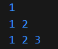

# go18_base

## go18基础课作业题
### 1.1 99乘法表 Table9
1. 打印一个99矩阵
2. 解决对齐问题（不用\t）
   * 观察 第一列 连同结果占2个格子；第二列 连同结果占3个格子；
   * 找到一个条件判断，条件是判断列；
3. 写的漂亮一些，用width变量控制，只写一个fmt.printf语句
4. 当第二列以上的时候，每次都要width=3，做了无用功，减少width重复赋值
   * 在外面赋值width=2，进入循环判断后width++
5. 调整到打印对角线，先j后i，对角线i和j是相等的，每一行打印到列号=i就走到头了
### 1.2 随机数累加累乘 random_addmul
1. 构造20个随机数，要求20以内的非0正整数；
2. 奇数个累加，偶数个累乘
   * 要注意累乘，定义的数据类型可以覆盖结果，否则“溢出”，类型用uint64
   * 累乘和累加，可以用*=  +=
   * 累乘注意定义的random要强制类型转换成uint64
   * 在循环里搞定累乘和累加
### 1.3.1 斐波那契数列_循环版 fib_loop
1. 必须有两个初值：第一项 fib(1)=1 第二项 fib(2)=1
2. 判断项数必须符合要求，不能有负数，第0项 fib(0)=0
3. 给两个初值，然后用for循环来控制，打印结果是100以内，for循环不知道变量是谁，循环多少次，先放着，写循环体
4. 循环体，观察计算过程fib(3)，前两项之和赋值给b，b在赋值给a，然后a+b就是fib(3)，可以写出循环体
5. 如何写for，使用i来控制循环，通过观察，循环的次数和n-2有关系
6. 现在仅仅是根据给出项数，打印对应的fib值。需要给出项数，把之前所有的都打印了。这个是在main函数中写for循环
7. 是在main函数中的for循环写条件控制fib(n)的值不能超过100，避免两遍计算
* 此题的关键1，fib_loop函数中，for循环之前要有两个初始值
* 此题的关键2，fib_loop函数中，for循环体内如何计算，观察fib手写找出规律
* 此题的关键3，fib_loop函数中，for循环条件如何写，怎么控制运行的趟数，观察fib手写找出规律，fib(3)跑一趟，fib(4)跑2趟
* 此题的关键4，怎么控制把之前的fib结果都打印出来，不是在fib_loop函数中实现，是在main函数中实现
### 1.3.2 斐波那契数列_递归版 fib_recuform
1. 是递归版，所以就不用写循环了
2. 直接return，根据公式来
3. 递归公式就是前进段，也得有返回段，返回段就是switch中的fib(0)=0, fib(1)=1, fib(2)=1
4. 和循环版的比较：
   * 递归版有返回段，前进段是自己调用自己，一直在栈帧里面叠压栈，直到遇到返回段层层消栈
   * 循环版有两个初值，传进来项数，要循环n-2趟，才能计算出出fib(n)，内部做的算法a+b->tmp  b->a  tmp->b。for循环i=0，i++,关键是要推算出中间循环多少趟
### 1.3.3 斐波那契数列_循环改递归版 fib_fib_reculoop
1. 函数设定，传项数，两个初值a=1，b=1
2. 算法类似循环版，最后return自己在调用自己，直到返回段return b
3. 类似递归版也是一直在压栈，最终return
4. 和循环版的比较：
   * 没有for语句控制趟数
   * 实际的趟数递归自己，是return 自己调用自己这个函数，让项数-1，最后返回b
   * 初值要传参进来，不能在函数内定义
5. 和递归版的比较：
   * 递归公式版压栈：fib_recuform(5)=fib_recuform(4)+fib_recuform(3)
                   先做左边的分支:       fib_recuform(4)=fib_recuform(3)+fib_recuform(2){1}
                                        fib_recuform(3)=fib_recuform(2){1}+fib_recuform(1){1}=2
                                        fib_recuform(4)=2+1=3
                   左边的分支有return了: fib_recuform(5)=3+fib_recuform(3)

                   在做右边的分支:
                                        fib_recuform(3)=fib_recuform(2){1}+fib_recuform(1){1}=2
               
                   最终 return 5:       fib_recuform(5)=3+2=5
                                     
                
      递归版压栈进行了大量的重复计算。fib_recuform(5)先进行左边的fib_recuform(4)压栈，直到return 3。在进行右边的fib_recuform(3)压栈，直到return 2。最后fib_recuform(5) return 5。
   * 递归循环版压栈：fib_reculoop(5,1,1)--->
                                           fib_reculoop(4,1,2)--->
                                                                   fib_reculoop(3,2,3)--->
                                                                                           fib_reculoop(2,3,5)  
     最终运行到n=2，将b的计算结果return，直接fib_fib_reculoop函数消亡。函数压栈了4次得出结果。
   * 循环版: 第一趟 i=0, i<5-2=3 True, a=1 b=1 tmp=2  最终:a=1 b=2
            第二趟 i=1, i<5-2=3 True, a=1 b=2 tmp=3 最终: a=2 b=3
            第三趟 i=2, i<5-2=3 True, a=2 b=3 tmp=5 最终: a=3 b=5
            第四趟 i=3, i<5-2=3 False 不满足条件退出循环
            最终return b=5。循环做了4次，计算做了3次。
### 2.1 观察切片的底层数组 getSliceDetails
1. 写函数，在主函数里面构建切片，传参给函数，由函数打印。函数打印返回字符串。

### 2.2 数组生成切片 arraySlice
1. 数组[1,4,9,16,2,5,10,15] 生成新的切片，新的切片元素是数组相邻2项的和。
2. 定义数组后，定义切片，切片的长度按照推理应该是len(a)-1
3. 循环数组的元素，循环到第一个元素加上下一个元素，追加到切片。
4. 按照推理循环的次数应该是长度少1次

### 2.3 数字重复统计 numsRepeat
* 随机产生10个整数，数字的范围[-100,100],降序输出这些数字，并且打印重复的次数
1. 考虑怎么生成随机数[-100,100]
2. 把生成的随机数追加到切片中，打印观察
3. 构建map，在循环中判断map[random]是否存在，不存在value=1，存在value++
4. 对随机数切片进行降序,把切片强制类型转换成IntSlice结构类，然后放在reverse里面。
5. 先打印生成的随机数降序；然后在打印map

### 3.1.1 阶乘_循环版 factorial_loop
1. 函数传参n，对n求阶乘，严谨要做判断，n不能<=0，n小于2直接返回1
2. 需要一个初始值，for循环可以用n来控制，倒数
3. for循环也可以不用n来控制，用i来控制，i和n比较，正数

### 3.1.2 阶乘_递归版 factorial_recu
1. 递归函数，一定要有返回段 阶乘的返回段是判断n=1，返回1
2. 递归函数，前进段，自己调用自己，自己是n，调用自己(n-1)

### 3.1.3 阶乘_循环递归版 factorial_reculoop
1. 形参1是项数, 形参2是基数1
2. 刚开始传参是项数和基数
3. 计算: 项数乘以上一次阶乘的结果,
4. 把本次的(项数-1)赋值给形参1, 把本次阶乘的结果赋值给形参2
5. 最终计算到n=1, 返回最终计算的结果

### 3.2 打印右下三角

   * 把宽度设置成一个变量
   * 如何计算宽度,只有知道最后一行才能知道宽度.所以先求最后一行的宽度,把最后一行设为宽度.
   * j控制每行的打印，i控制每一列
   * 如果是倒数，就是--；正数就是++
   * 四个控制循环是否进入，i,j,n,1

1. 打印正数矩阵

2. 打印倒数矩阵

3. 打印左下三角正数
   第一行 1
   第二行 1 2
   第三行 1 2 3 
   j循环一次打印一行中的一个数字.j退出了循环,打印回车.继续进入j循环打印下一行.
   
4. 打印左下三角倒数
   第一行 1
   第二行 2 1
   第三行 3 2 1
   
5. 打印左上三角正数
   第一行 1 2 3
   第二行 1 2
   第三行 1
   
6. 打印左上三角倒数
   * 第一行 3 2 1
   * 第二行 3 2
   * 第一行 3
  j循环控制打印每一行.每一行都是从n开始打印
   
7. 打印右下三角倒数
   第一行     1
   第二行   2 1
   第三行 3 2 1
   
8. 打印右下三角正数
   第一行     1
   第二行   1 2
   第三行 1 2 3
   

   * 思路：根据左下三角，往右边推
   * 如何往右推呢，用拼接字符串。不直接输出Printf，用Sprintf把一行拼接成一个字符串一块打印，带上宽度和右对齐.
   * 第二种思路:前面的每一行都是最后一行的字符串切片.
     * 可以打印最后一行字符串
     * 最后一行字符串,关键是去掉最后一个空格,倒着遍历  3 2 1
     * 第一行倒数碰到第一个空格,输出空格后面的
     * 第二行倒数碰到第二个空格,输出空格后面的
     * 如果没有碰到空格,则继续循环
     * 最后补上最后一行
### 4.1 求面积
实现圆形，三角形，长方形的面积
1. 定义三个对象：圆形，三角形，长方形。
2. 给对象定义构造函数,通过函数来构造实例.
3. 这三个对象都要实现计算面积的动作
   * 在各自的方法里面,接收实例,计算面积,返回结果
4. 定义接口,接口要求实现计算面积的动作
5. main函数调用构造函数,传参构造三个对象的实例.
6. main函数定义一个接口类变量,哪个实例赋值给接口,接口变量来统一实现面积的计算.
### 4.2 实例排序
1. main中调用构造函数，构造3个实例。
2. 要对这3个实例排序，找共同特征进行排序，共同特征就是面积。
3. 三个实例赋值给接口变量，由接口变量统一调area方法，计算各自的面积。
4. 构造一个切片，切片类型是接口类，里面放着3个实例
6. 利用sort包的slice函数, 对3个实例, 按照面积特征进行就地排序, 然后遍历打印
   ```go
 	sort.Slice(ifs,func(i,j int)bool{
		return ifs[i].calcarea()>ifs[j].calcarea()
	})
   // 相当于手动实现
   sort.Sort(sort.Interface {
    Len: func() int { return len(ifs) },
    Less: func(i, j int) bool {
        return ifs[i].calcarea() > ifs[j].calcarea()
    },
    Swap: func(i, j int) {
        ifs[i], ifs[j] = ifs[j], ifs[i]
    },
   })
   // i,j这两个变量是谁给的,是怎么来的. 这些索引是go排序库内部控制自动传入的索引,你不需要自己传入.你写的函数作为"比较器"传入sort.Slice库,告诉如何交换这两个元素,配合另两个方法进行操作len() swap()
   // go每次比较都会调用你传入的"比较器",自动传入i,j索引,在原切片上就地排序.
   ```
7. 以上排序的问题是每次排序都要调用方法重新做计算. 解决方法是把计算得到的面积放在自己实例的属性中,以后直接比较属性值做排序
   * 面积可以计算出来，在每个结构类里面定义面积属性，保存面积。把面积抽象出来，所有对象继承。
   * 改造calcarea方法, 判断面积属性=0,说明这个实例是新实例,才计算一次面积,存在area属性中
   * 排序算法第一次调用的时候,area是空,计算.之后相同的实例在进行排序不需要重复计算.
   * 刚开始构造实例,area属性是空.
   * 调用就地排序,只计算一次面积.之后在调用排序无需重复计算.


